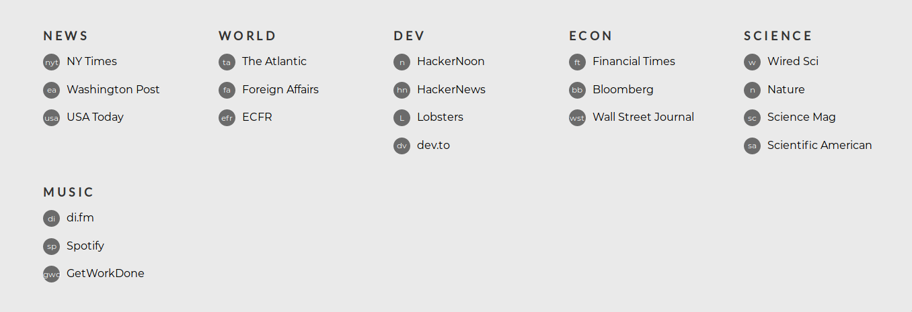

# homepage

Simple, customizable homepage.



## Setting up

The links that will be shown in the page must be defined in the file `src/links.ts`. An example file ([src/example_links.ts](src/example_links.ts)) is provided in the repo. This file must define an object named "data" that acts as a nested dictionary:

```js
"News": {
	"nyt": {
		"url": "https://www.nytimes.com/",
		"name": "NY Times"
	}
}
````

Once the `links.ts` file has been set up, running `yarn build` will compile the TS and SCSS files into the `dist` folder. The `dist/index.html` file will display the homepage.

### Future work

* Store Lato and Montserrat fonts locally.
* Add an input field when the user presses keys that will help opening links without having to reach for the mouse. Note that pressing the key of a link (e.g. "nyt") followed by Enter will already work.
* Integrate sass into webpack.
* Minify CSS.
